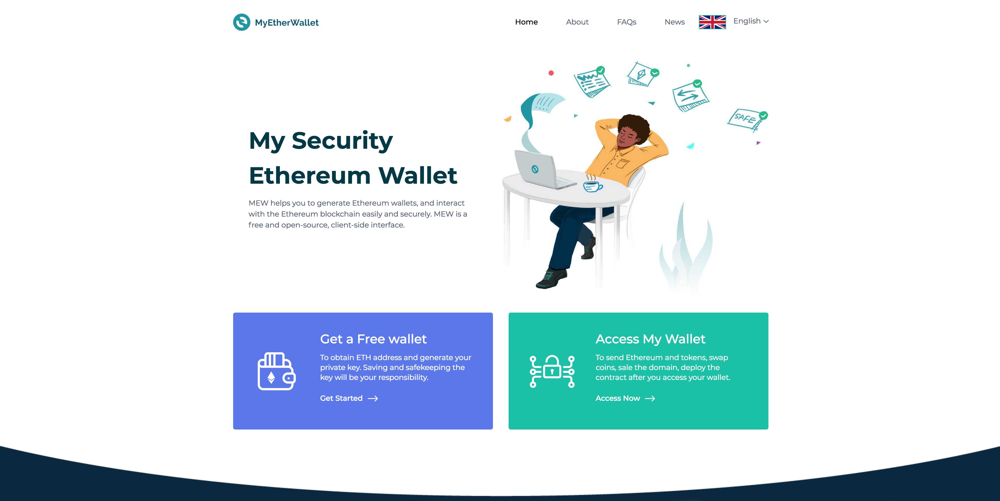

XDC Wallet is a open-source, free, client-side tool for easily & securely interacting with the XDC blockchain. The wallet is dedicated to provide all the stakeholders with an easy-to-understand and accessible suite of tools for their needs. The wallet is primarily Designed for token transfer and track account details of any account on XinFin network.
<!-- 

 
 

MyEtherWallet is a doorway to the XinFin blockchain, allowing users to manage their own funds without a centralized platform. -_Stephen, #MEWForce_

 -->

## Philosophy

- **Empower the people**: Give people the ability to interact with the XinFin blockchain easily, without having to run a full node.
- **Make it easy & free**: Everyone should be able to create a wallet and send Ether & Tokens without additional cost.
- **People are the Priority**: People are the most important & their experience trumps all else. If monetization worsens the experience, we don't do it. (e.g. ads)
- **A learning experience, too**: We want to educate about XinFin, security, privacy, the importance of controlling your own keys, how the blockchain works, and how XinFin and blockchain technologies enable a better world.
- **If it can be hacked, it will be hacked**: Never save, store, or transmit secret info, like passwords or keys.
- **Offline / Client-Side**: User should be able to run locally and offline without issue.
- **Private**: No tracking!!! No emails. No ads. No demographics. We don't even know how many wallets have been generated, let alone who / what / where you are.
- **Open source & audit-able**

## Getting started

1. Open terminal
2. Clone the repo: `git clone https://github.com/XinFinOrg/Wallet`
3. run `npm i` to install node packages.
4. run `npm build .` You can also use the offline version by opening the index file from the dist folder with your preferred browser
5. start `npm run dev`
6. App should be running in `https://localhost:8080`

### Errors :- 

To Install canvas@1.6.3,You can quickly install the dependencies by using the command for your OS:

OS | Command
----- | -----
OS X | `brew install pkg-config cairo libpng jpeg giflib`
Ubuntu | `sudo apt-get install libcairo2-dev libjpeg-dev libpango1.0-dev libgif-dev build-essential g++`
Fedora | `sudo yum install cairo cairo-devel cairomm-devel libjpeg-turbo-devel pango pango-devel pangomm pangomm-devel giflib-devel`
Solaris | `pkgin install cairo pkg-config xproto renderproto kbproto xextproto`
Windows | [Instructions on our wiki](https://github.com/Automattic/node-canvas/wiki/Installation---Windows)

## Bug / Feature Request

If you find a bug, or want a new feature added, please submit it on the [Github Issues](https://github.com/XinFinOrg/Wallet/issues)
